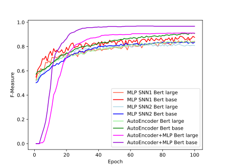

# Pairwise Matching

## Description
Integrating data from various sources significantly enhances the power of information, enabling us to tackle questions that cannot be resolved with a single data source. Record Linkage (RL) involves identifying and connecting records from multiple sources that refer to the same real-world entity (e.g., a person). It is vital for the data integration process. This study aims to propose an RL model for unstructured data. We evaluated four different architectures, using BERT to generate embeddings as input for the models.

## Dataset
The dataset used is from the DI2KG 2020 challenge, available [here](http://di2kg.inf.uniroma3.it/2020/#challenge).

## Usage
To replicate our experiments:
1. Download the dataset and place it in a folder named "dataset."
2. Run the "bert_embedder" notebook to generate the embeddings.
3. Test the individual architectures by running the corresponding notebook.

## Experimental Results
All configurations achieve an F1-measure above 0.8 after 100 epochs of training, with potential for improvement with longer training and more accurate hyperparameter tuning. These promising results justify the choice of using BERT over Word2Vec for generating embeddings from unstructured data entries.

## Further Details
Additional informations about all the architectures and configurations can be found in our [report](report.pdf).

## Contributors
- Simone Albero
- Giordano Andreola
- Elisa Catena
- Maria De Domenico
